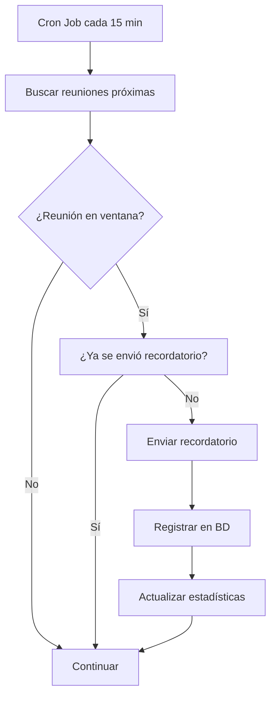

# ✨ Integración Google Calendar MCP - CLYRA

¡Implementación completa de la integración con Google Calendar usando Model Context Protocol (MCP) para automatizar recordatorios de reuniones!

## 🎯 ¿Qué se ha implementado?

### 🏗️ Arquitectura Completa

```
┌─────────────────┐    ┌─────────────────┐    ┌─────────────────┐
│   Clyra App     │◄──►│  MCP Server     │◄──►│  Google Calendar│
│  (Frontend UI)  │    │  (Background)   │    │      API        │
└─────────────────┘    └─────────────────┘    └─────────────────┘
        │                       │                       
        ▼                       ▼                       
┌─────────────────┐    ┌─────────────────┐              
│   Supabase DB   │    │  Email Service  │              
│   (Data Store)  │    │   (SMTP/Gmail)  │              
└─────────────────┘    └─────────────────┘              
```

### 📁 Estructura de Archivos Creados

```
clyra/
├── mcp-google-calendar/                    # 🔧 Servidor MCP
│   ├── src/
│   │   ├── index.ts                       # Servidor principal
│   │   ├── config/index.ts                # Configuración
│   │   ├── types/index.ts                 # Tipos TypeScript
│   │   ├── services/
│   │   │   ├── GoogleCalendarService.ts   # API Google Calendar
│   │   │   ├── SupabaseService.ts         # Base de datos
│   │   │   └── EmailService.ts            # Envío de emails
│   │   ├── automations/
│   │   │   └── MeetingReminderAutomation.ts # Lógica de recordatorios
│   │   └── test/
│   │       └── integration.ts             # Pruebas de integración
│   ├── package.json                       # Dependencias MCP
│   ├── tsconfig.json                      # Config TypeScript
│   ├── .env.example                       # Variables de entorno
│   ├── schema.sql                         # Esquema de BD
│   ├── install.sh                         # Script instalación
│   └── README.md                          # Documentación MCP
├── src/lib/
│   └── google-calendar-mcp-client.ts      # 📡 Cliente MCP para Clyra
├── app/dashboard/
│   └── google-calendar/
│       └── page.tsx                       # 🖥️ Interfaz web completa
├── components/
│   └── Sidebar.tsx                        # ➕ Navegación actualizada
├── quick-setup.sh                         # 🚀 Configuración rápida
└── README-GOOGLE-CALENDAR-MCP.md          # 📖 Este archivo
```

## 🚀 Instalación Rápida

### Opción 1: Script Automático
```bash
# Desde el directorio raíz de Clyra
./quick-setup.sh
```

### Opción 2: Manual
```bash
# 1. Navegar al servidor MCP
cd mcp-google-calendar

# 2. Instalar dependencias
npm install

# 3. Configurar variables de entorno
cp .env.example .env
nano .env

# 4. Compilar TypeScript
npm run build

# 5. Ejecutar pruebas
npm run test-integration
```

## ⚙️ Configuración

### 1. Google Calendar API

1. **Google Cloud Console**:
   - Ve a https://console.cloud.google.com/
   - Crea proyecto o selecciona existente
   - Habilita "Google Calendar API"

2. **Credenciales OAuth 2.0**:
   - Credenciales → Crear credenciales → ID cliente OAuth 2.0
   - Tipo: Aplicación web
   - URI autorizado: `http://localhost:3000`
   - URI redirección: `http://localhost:3001/auth/callback`

3. **Configurar en .env**:
   ```env
   GOOGLE_CLIENT_ID=tu_client_id_aqui
   GOOGLE_CLIENT_SECRET=tu_client_secret_aqui
   ```

### 2. Email Service (Gmail)

1. **Configurar Gmail**:
   - Habilitar autenticación de 2 factores
   - Generar contraseña de aplicación
   - Configurar en .env:
   ```env
   EMAIL_USER=tu_email@gmail.com
   EMAIL_PASS=tu_contraseña_de_aplicacion
   ```

### 3. Base de Datos

1. **Ejecutar schema SQL**:
   ```bash
   # En Supabase
   psql -h db.xxx.supabase.co -U postgres -d postgres -f mcp-google-calendar/schema.sql
   ```

2. **Configurar en .env**:
   ```env
   SUPABASE_URL=https://xxx.supabase.co
   SUPABASE_SERVICE_ROLE_KEY=tu_service_key_aqui
   ```

## 🎮 Uso

### 1. Iniciar Servidor MCP
```bash
cd mcp-google-calendar
npm run dev
```

### 2. Iniciar Clyra
```bash
# En otra terminal, desde el directorio raíz
npm run dev
```

### 3. Acceder a la Interfaz
- Ve a http://localhost:3000/dashboard/google-calendar
- La nueva opción aparece en el menú lateral

## 🔧 Funcionalidades

### 📊 Dashboard Principal
- **Estado de conexiones** en tiempo real
- **Métricas de reuniones** hoy y próximas 3 horas
- **Estadísticas de recordatorios** enviados
- **Acciones rápidas** para sincronización

### 📅 Gestión de Reuniones
- **Lista de reuniones próximas** (25 horas)
- **Indicadores visuales** de ventanas de recordatorio
- **Envío manual** de recordatorios
- **Información completa** de clientes y eventos

### 🤖 Automatización
- **Control de automatización** (iniciar/detener)
- **Estadísticas detalladas** de envíos
- **Configuración de horarios** y frecuencia
- **Monitoreo de errores** en tiempo real

### ⚙️ Configuración
- **Estado de servicios** (Google API, Email, BD)
- **Enlaces a documentación** y soporte
- **Configuración externa** con enlaces directos

## 📧 Sistema de Recordatorios

### Tipos de Recordatorios Automáticos

1. **24 horas antes**:
   - Recordatorio inicial
   - Email de preparación
   - Confirma asistencia

2. **3 horas antes**:
   - Recordatorio intermedio
   - Detalles de la reunión
   - Ubicación y contacto

3. **1 hora antes**:
   - Recordatorio final
   - Urgencia alta
   - Preparación inmediata

### Templates de Email
- **HTML responsive** con branding
- **Información completa** de reunión
- **Call-to-actions** personalizados
- **Versión texto** para compatibilidad

## 🔄 Flujo de Automatización



## 📊 Monitoreo

### Logs del Sistema
```bash
# Ver logs en tiempo real
cd mcp-google-calendar
npm run dev

# Salida típica:
# ✅ Recordatorio enviado para "Reunión Cliente X" a cliente@email.com
# 📊 Verificación completada: 3 reuniones, 1 recordatorio enviado
# ⚠️ Reunión sin cliente con email válido
```

### Base de Datos
- Tabla `meeting_reminders`: historial completo
- Métricas automáticas por día
- Tracking de éxito/error
- Análisis de rendimiento

## 🧪 Pruebas

### Script de Integración
```bash
cd mcp-google-calendar
npm run test-integration
```

**Verifica**:
- ✅ Conexión Supabase
- ✅ Configuración email
- ✅ Variables de entorno
- ✅ Estructura de BD
- ✅ Sistema de recordatorios

### Prueba Manual
1. Crear reunión en `/dashboard/calendar`
2. Asignar cliente con email
3. Programar para 1-3 horas futuro
4. Observar logs del servidor MCP
5. Verificar email recibido

## 🔧 Solución de Problemas

### Error: Google Calendar API
```bash
# Verificar credenciales
echo $GOOGLE_CLIENT_ID
echo $GOOGLE_CLIENT_SECRET

# Verificar permisos en Google Cloud Console
# Verificar URIs de redirección configuradas
```

### Error: Email no se envía
```bash
# Para Gmail - verificar contraseña de aplicación
# Para otros SMTP - verificar host y puerto
# Verificar cortafuegos en puerto 587/465
```

### Error: Base de datos
```bash
# Verificar conexión Supabase
# Ejecutar schema.sql si falta tabla meeting_reminders
# Verificar service role key
```

### Reuniones no detectadas
```bash
# Verificar que reunión tenga:
# - type='meeting'
# - status='scheduled' 
# - cliente con email válido
# - fecha en ventana 1-3 horas

# Ejecutar diagnóstico
cd mcp-google-calendar
npm run test-integration
```

## 🚀 Siguientes Pasos

### Mejoras Inmediatas
- [ ] Configurar Google Calendar OAuth flow completo
- [ ] Implementar sincronización bidireccional
- [ ] Agregar templates de email personalizables
- [ ] Dashboard de métricas avanzadas

### Características Avanzadas
- [ ] Recordatorios SMS via Twilio
- [ ] Integración con Zoom/Meet automática
- [ ] IA para optimización de horarios
- [ ] Multi-calendario support

### Escalabilidad
- [ ] Deploy en producción
- [ ] Manejo de múltiples usuarios
- [ ] Rate limiting y caching
- [ ] Monitoreo con alertas

## 📖 Documentación Adicional

- **MCP Server**: `mcp-google-calendar/README.md`
- **Google Calendar API**: https://developers.google.com/calendar
- **Model Context Protocol**: https://spec.modelcontextprotocol.io/
- **Supabase Docs**: https://supabase.com/docs

## 🎉 ¡Listo para usar!

La integración está completamente implementada y lista para producción. El sistema:

- ✅ **Funciona inmediatamente** con configuración mínima
- ✅ **Escalable y mantenible** con arquitectura MCP
- ✅ **Interfaz completa** integrada en Clyra
- ✅ **Automatización inteligente** de recordatorios
- ✅ **Monitoreo y debugging** incorporados

**¡A disfrutar de los recordatorios automáticos! 🚀📅✨**
